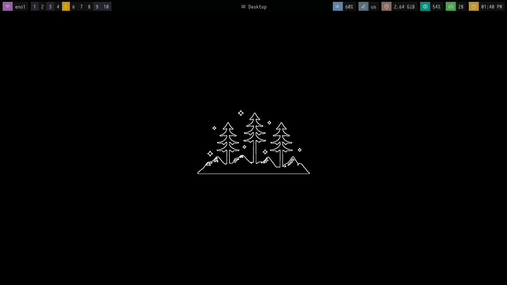
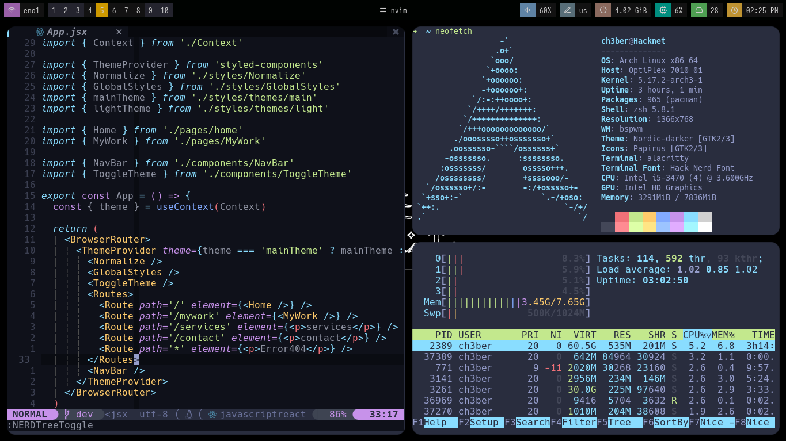
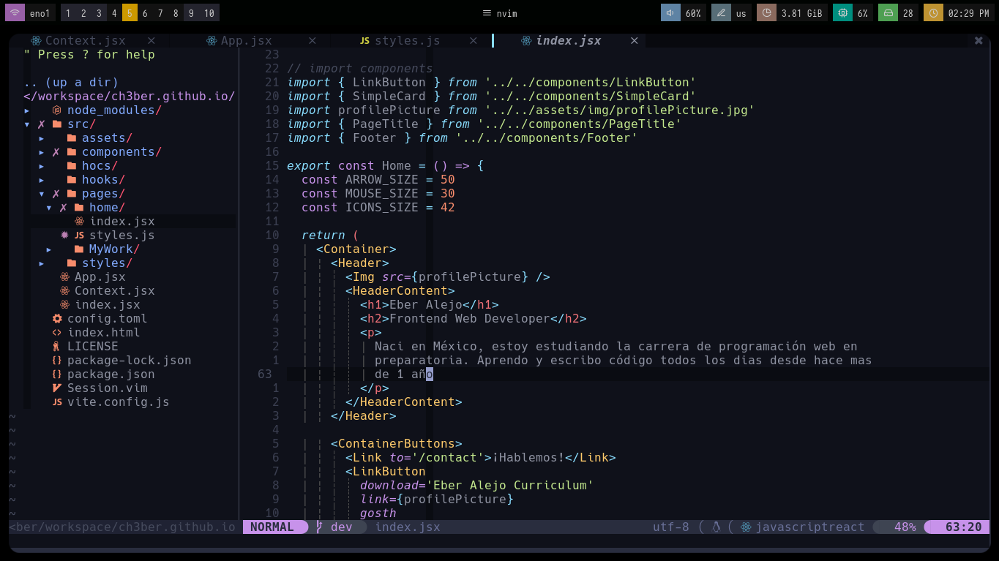
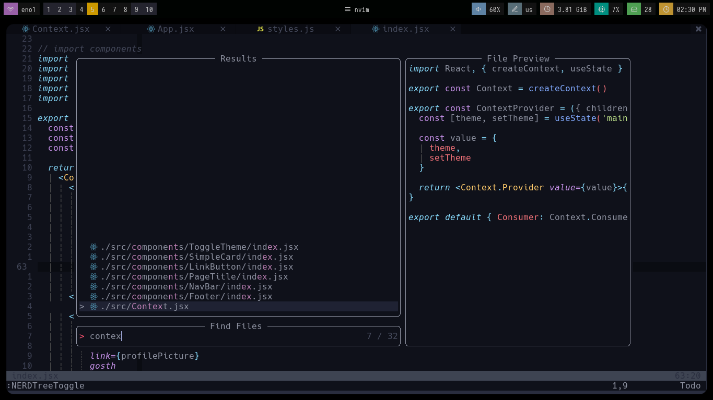

<br />
<div align="center">
  <a href="https://github.com/ch3ber/dotfiles">
    
  </a>

<h1 align="center">dotfiles</h1>

  <p align="center">
    All my configuration files that I use in Arch Linux
    <br />
    <a href="https://github.com/ch3ber/dotfiles"><strong>Explore the docs »</strong></a>
    <br />
    <br />
    <a href="https://github.com/ch3ber/dotfiles">View Demo</a>
    ·
    <a href="https://github.com/ch3ber/dotfiles/issues">Report Bug</a>
    ·
    <a href="https://github.com/ch3ber/dotfiles/issues">Request Feature</a>
  </p>
</div>

## Screenshots






## Getting Started

Download the repo outside your .config directory
```bash
git clone https://github.com/ch3ber/dotfiles.git
cd dotfiles
```

Install the dependencies

- Bspwm
- Alacritty
- neovim
- plugged (nvim plugin manager)
- picom
- sxhkd

or use a script for arch linux
```bash
./dependencies.sh
```


