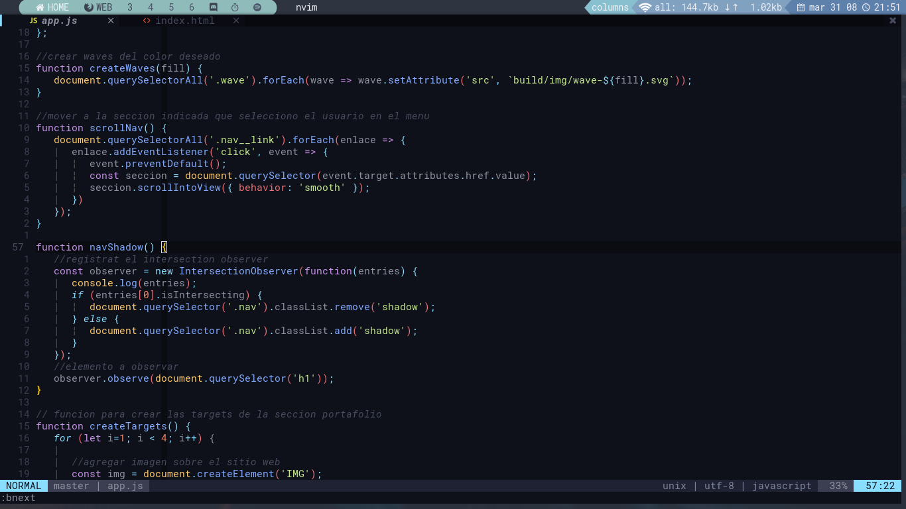
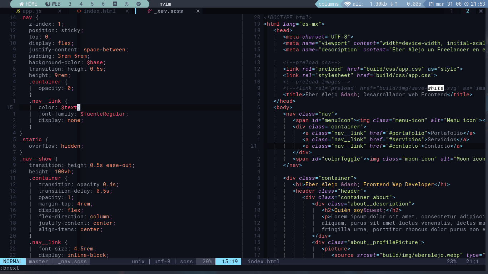
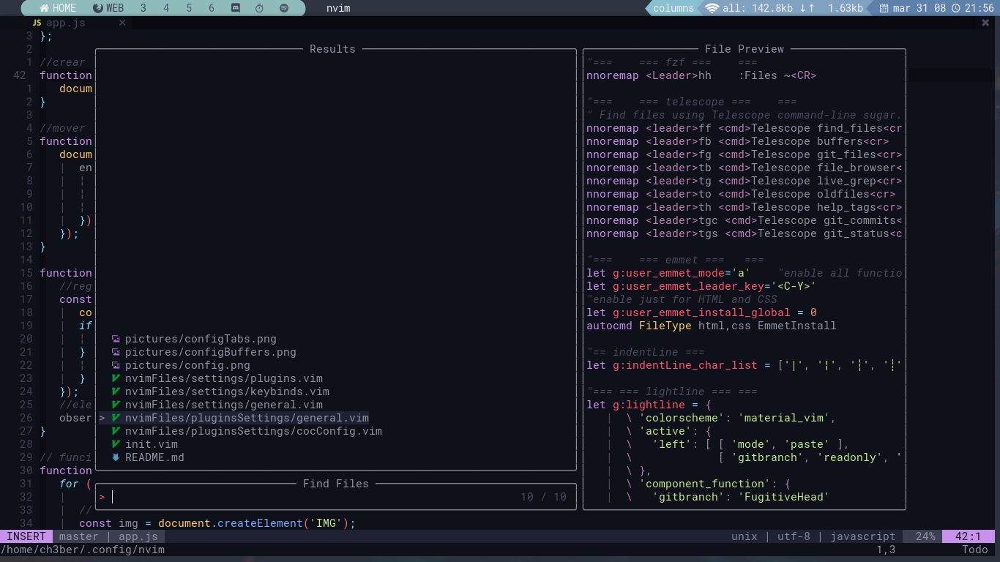

# config-nvim
My personal configuration for nvim

## Instalation
1. Use `git clone https://github.com/chEber405/config-nvim` into `~/.config/`
1. Delete his current nvim config `rm -rf nvim`
1. rename config-nvim to nvim `mv config-nvim nvim`

## Plugin manager
Plugin manager: [vim-plug](https://github.com/junegunn/vim-plug)
Install the plugins whit `:PlugInstall`

### Dependencies for the plugins
- ranger:  [ranger](https://github.com/ranger/ranger)
- fzf: [fzf](https://github.com/junegunn/fzf)
- CoC: [nodejs](https://nodejs.org/en/download/)

#### Optional
- enable clipboard support: [xclip](https://archlinux.org/packages/extra/x86_64/xclip/)
